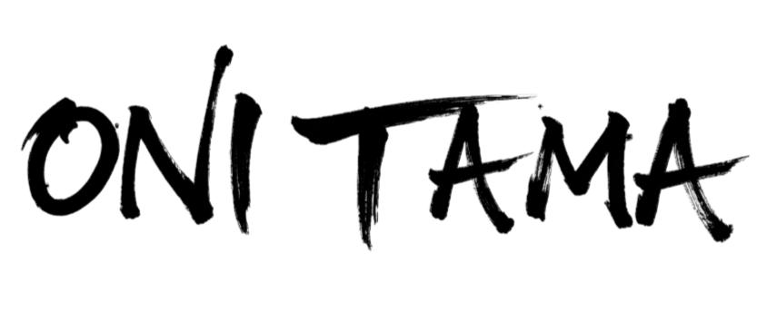

  

# ¡Hola! Somos Iron Taisen
 
**Iron Taisen** es un equipo de desarrollo de la Universidad de Zaragoza. Este repositorio contiene nuestra versión de Onitama, un juego de estrategia abstracta para dos jugadores donde el objetivo es capturar el rey rival o llegar con el propio a su casilla base. Los movimientos vienen dados por cartas que rotan entre ambos jugadores. 

**Pero... se podía mejorar, y este es el resultado.**
 
Ampliamos el tablero a 7x7 y añadimos casillas trampa: cada jugador coloca una en secreto al inicio y el rival no la descubre hasta que pierde una pieza. Antes de empezar, cada jugador elige una carta de acción de dos posibles —la rechazada va al rival— y solo puede usarla una vez por partida. Por último, ampliamos el mazo de movimiento respecto al original, dando lugar a más combinaciones y partidas que nunca se repiten igual.
 
¡Esperamos que te guste!

**Iron Taisen was here.**